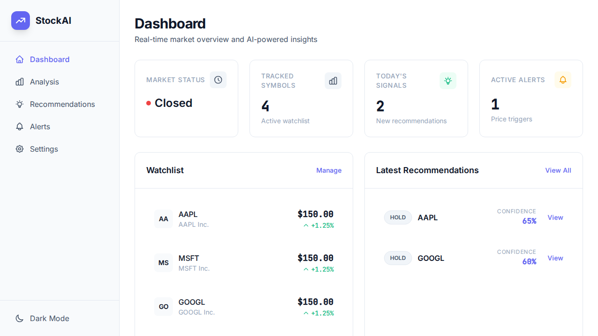
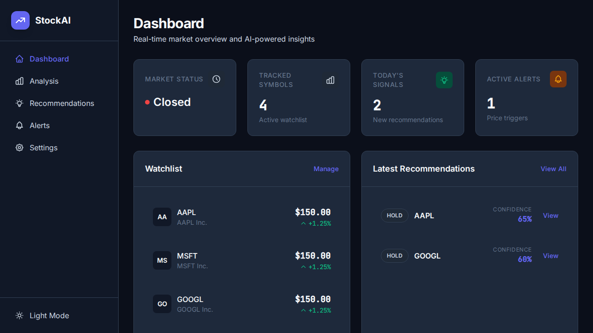
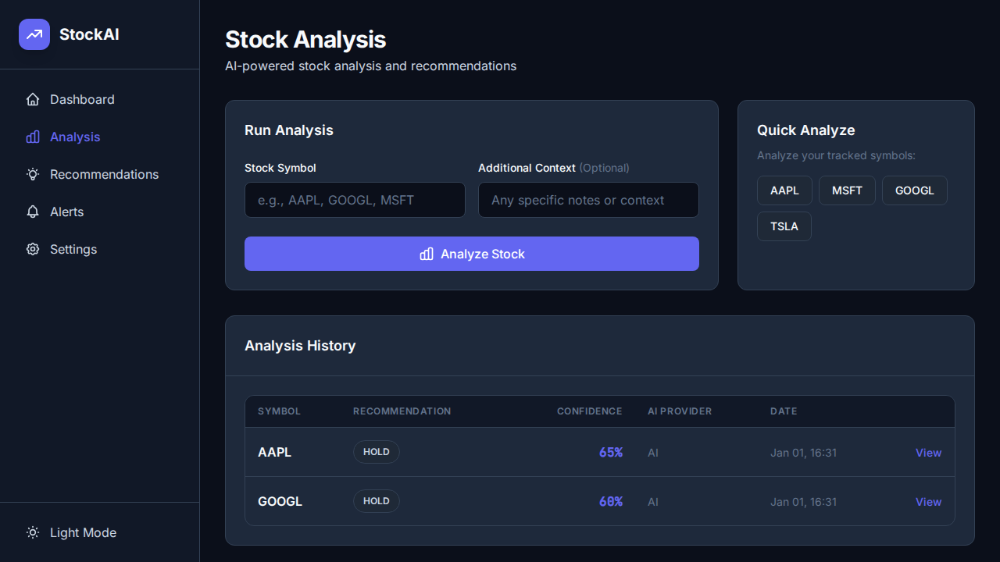
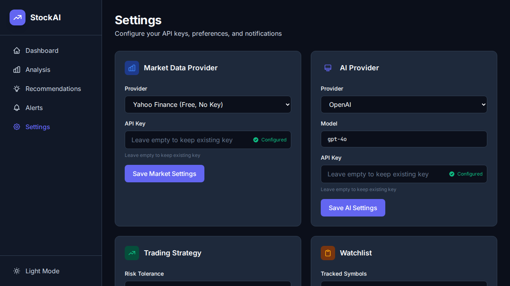

# StockAI - AI-Powered Stock Analysis Platform

A self-hosted stock market tracking and AI-powered analysis platform. Get real-time market data, AI trading recommendations, and price alerts—all in a single Go binary with no external dependencies.



## Features

- 📊 **Real-time Market Data** - Live prices from Yahoo Finance, Alpha Vantage, or Finnhub
- 🤖 **AI-Powered Analysis** - Get buy/sell/hold recommendations from OpenAI, Claude, or Gemini
- 🎯 **Customizable Strategy** - Configure risk tolerance and trading frequency
- 🔔 **Price Alerts** - Set custom price thresholds with multi-channel notifications
- 🌙 **Dark Mode** - Beautiful light and dark themes
- ⚡ **Fast & Lightweight** - Single binary, SQLite database, no Docker required

## Screenshots

<details>
<summary>📈 Dashboard (Dark Mode)</summary>


</details>

<details>
<summary>🔬 Stock Analysis</summary>


</details>

<details>
<summary>⚙️ Settings</summary>


</details>

## Quick Start

```bash
# Clone and build
git clone https://github.com/exedev/stockai.git
cd stockai
make build

# Run (default port 8000)
./bin/server

# Or with custom port
PORT=5000 ./bin/server
```

Then open <http://localhost:8000> and:

1. Go to **Settings**
2. Add your AI provider API key (OpenAI, Claude, or Gemini)
3. Add stock symbols to your watchlist
4. Run your first analysis!

## Tech Stack

| Component | Technology |
| --------- | ---------- |
| Backend | Go 1.23+ |
| Frontend | [templ](https://templ.guide) + [HTMX](https://htmx.org) + [Tailwind CSS](https://tailwindcss.com) |
| Database | SQLite (WAL mode) |
| AI | OpenAI GPT-4, Anthropic Claude, Google Gemini |
| Market Data | Yahoo Finance (free), Alpha Vantage, Finnhub |

## Architecture

```text
┌─────────────────────────────────────────────────────────┐
│                   Single Go Binary                      │
├─────────────────────────────────────────────────────────┤
│  templ Components + HTMX + Tailwind CSS                 │
│  ┌─────────┬──────────┬─────────────┬────────┐         │
│  │Dashboard│ Analysis │Recommendations│Alerts │         │
│  └─────────┴──────────┴─────────────┴────────┘         │
├─────────────────────────────────────────────────────────┤
│              REST API + WebSocket                       │
├─────────────────────────────────────────────────────────┤
│  ┌─────────────┐ ┌─────────────┐ ┌───────────────┐     │
│  │ Market Data │ │ AI Analyzer │ │ Notifications │     │
│  │  Provider   │ │   Router    │ │ Email/Discord │     │
│  └─────────────┘ └─────────────┘ └───────────────┘     │
├─────────────────────────────────────────────────────────┤
│                      SQLite DB                          │
└─────────────────────────────────────────────────────────┘
```

## Configuration

### Environment Variables

| Variable | Default | Description |
| -------- | ------- | ----------- |
| `PORT` | 8000 | Server port |
| `DATABASE_PATH` | ./stockmarket.db | SQLite database path |
| `ENCRYPTION_KEY` | (auto-generated) | Base64 32-byte key for API key encryption |
| `ENVIRONMENT` | development | `development` or `production` |

### Market Data Providers

- **Yahoo Finance** (default) - Free, no API key required
- **Alpha Vantage** - Free tier available, API key required
- **Finnhub** - Free tier available, API key required

### AI Providers

- **OpenAI** - GPT-4, GPT-4o
- **Anthropic** - Claude 3 Sonnet, Claude 3 Opus
- **Google** - Gemini Pro

### Trading Strategies

| Risk Tolerance | Description |
| -------------- | ----------- |
| Conservative | Capital preservation, lower volatility |
| Moderate | Balanced growth and risk |
| Aggressive | Maximum growth, higher volatility |

| Trade Frequency | Description |
| --------------- | ----------- |
| Daily | Short-term, intraday signals |
| Weekly | Medium-term positions |
| Swing | 2-6 week holding periods |

## Development

```bash
# Install templ CLI
go install github.com/a-h/templ/cmd/templ@latest

# Generate templ files
make generate

# Build
make build

# Run in development
make dev

# Run tests
make test
```

### Project Structure

```bash
├── cmd/server/          # Main application entry point
├── internal/
│   ├── api/             # REST API handlers
│   ├── config/          # Configuration management
│   ├── db/              # SQLite database layer
│   ├── market/          # Market data providers
│   ├── ai/              # AI analysis providers
│   ├── notify/          # Notification services
│   └── web/
│       ├── components/  # Reusable templ components
│       ├── pages/       # Page templates
│       └── static/      # CSS, JS assets
└── docs/screenshots/    # Documentation images
```

## Deployment

### Systemd Service

```bash
sudo cp stockmarket.service /etc/systemd/system/
sudo systemctl daemon-reload
sudo systemctl enable stockmarket
sudo systemctl start stockmarket
```

### Docker (optional)

```bash
docker build -t stockai .
docker run -p 8000:8000 -v ./data:/data stockai
```

## API Reference

### Pages

| Route | Description |
| ----- | ----------- |
| `GET /` | Dashboard |
| `GET /analysis` | Stock analysis |
| `GET /recommendations` | Trading recommendations |
| `GET /alerts` | Price alerts |
| `GET /settings` | Configuration |

### REST API

| Route | Description |
| ----- | ----------- |
| `GET /api/health` | Health check |
| `POST /api/analyze` | Run AI analysis |
| `GET /api/recommendations` | Get recommendations |
| `POST /api/alerts` | Create price alert |
| `DELETE /api/alerts/:id` | Delete alert |
| `POST /api/config/*` | Update settings |

### WebSocket

| Route | Description |
| ----- | ----------- |
| `GET /ws` | Real-time price updates |

## License

MIT
